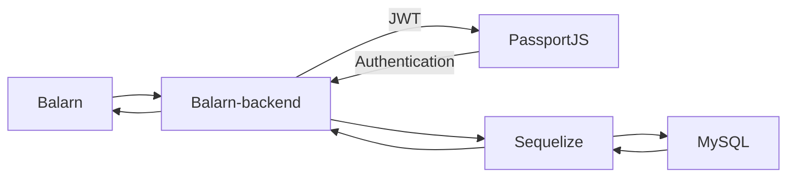

# Balarn

## 📘 Description

A Personal Final-Project in CodeCamp 2019. This project is creating for everyone who wants the money management system like a virtual wallet so you can add a virtual-wallet representative
for the pouch, the bank account, and also everyday wallet. This project will make your life easier than before so you can manage an income and an outcome like a boss XD.

## 📦 Built With

- [Ant Design](https://ant.design/) - A CSS Framework
- [Create React App](https://github.com/facebook/create-react-app) - A Project Creator
- [React](https://reactjs.org/) - A Frontend Framework
- [Redux](https://redux.js.org/) - A Predictable state Container for JavaScript apps

## 🛠 Structure





## 📋 Features

- View a virtual wallet.
- Create, Rename and Remove the Wallet. `[Coming Soon!]`
- Named your wallet. `[Coming Soon!]`
- Make the transaction like deposit and withdraw. `[Coming Soon!]`
- See history spending. `[Coming Soon!]`
- Wallet Dashboard. `[Coming Soon!]`
- Role managements. `[Coming Soon!]`

## 🏷 Versioning

- Current Version: 0.1.1
- For the versions available, see the [tags on this repository.](https://github.com/buildingwatsize/balarn/tags)

## 💡 Getting Started

1️⃣ Clone this project by

  ```bash
    git clone https://github.com/buildingwatsize/balarn.git
  ```

2️⃣ Run Commands

  ```bash
    npm install # or just `yarn`

    npm start # or just `yarn start`

    # Default link: http://localhost:3000/
  ```

3️⃣ Enjoy with :D

## 📚 Acknowledgments

You can learn more in the [Create React App documentation](https://facebook.github.io/create-react-app/docs/getting-started).

To learn React, check out the [React documentation](https://reactjs.org/).

## 😎 Author

Chinnawat Chimdee

## 🚩 Created at

9 Dec 2019
